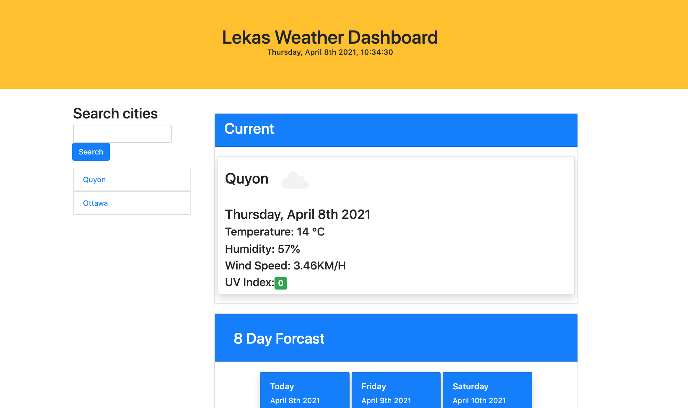

Weather dashboard app with city search history

This simple to use Weather Application displays the weather for selected city.

This website utilizes:
- localstorage to store city search history
- openweathermap API to display frocasts
- bootstrap as CSS framework

Features:
- current weather
- today's forcast + 7 day forcast
- showing uvi index based on severity 
- green feveroable uvi level
- yellow modarate uvi level
- red danger uvi level
- weather condition image

The following image demonstrates the web application's appearance:

To view the working app use the link below:

https://elmir123.github.io/lekas-weather-dashboard/
